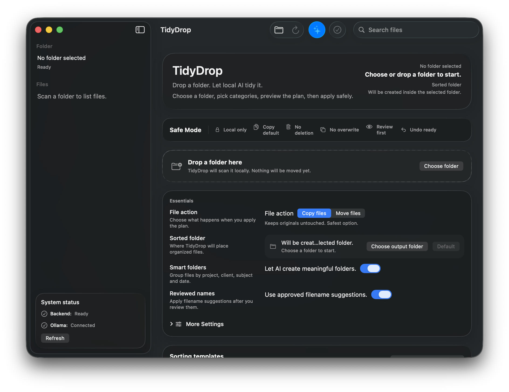
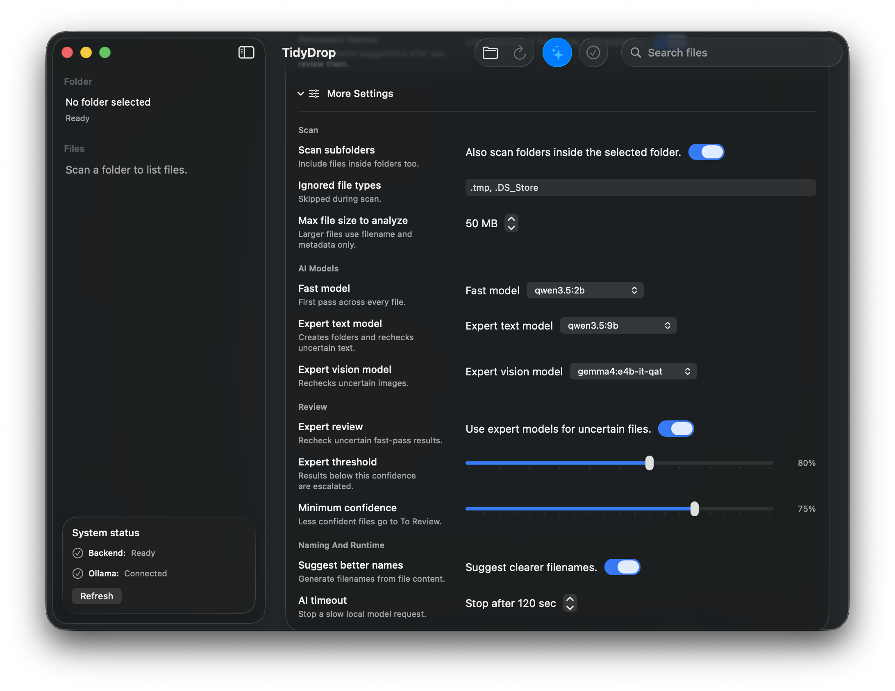
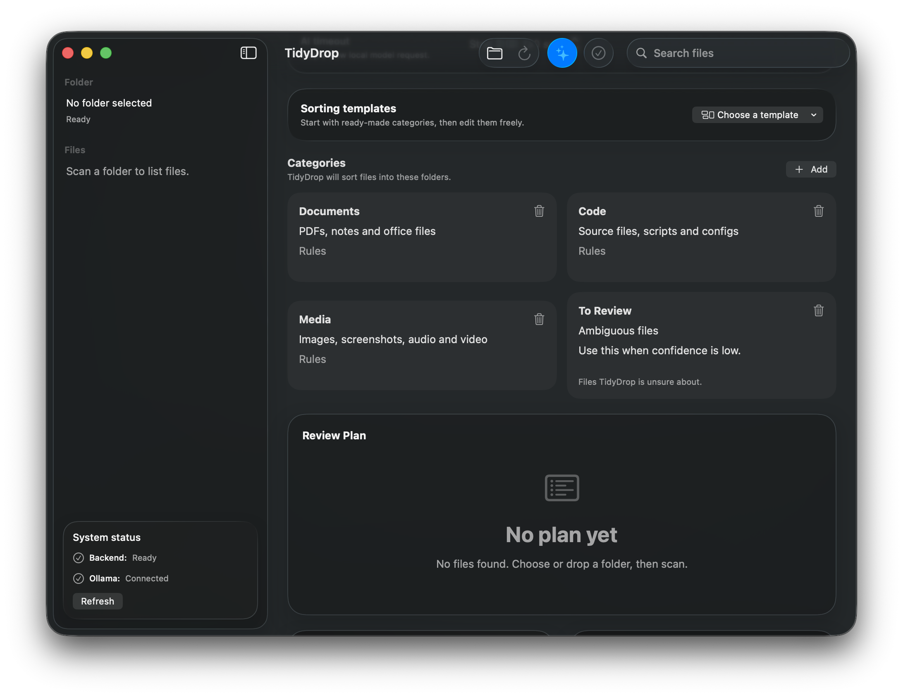
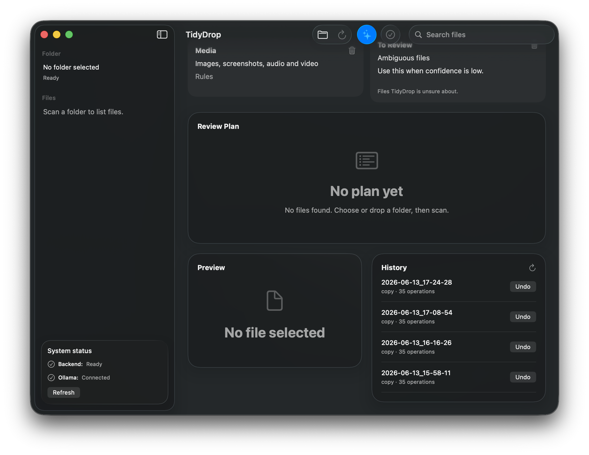
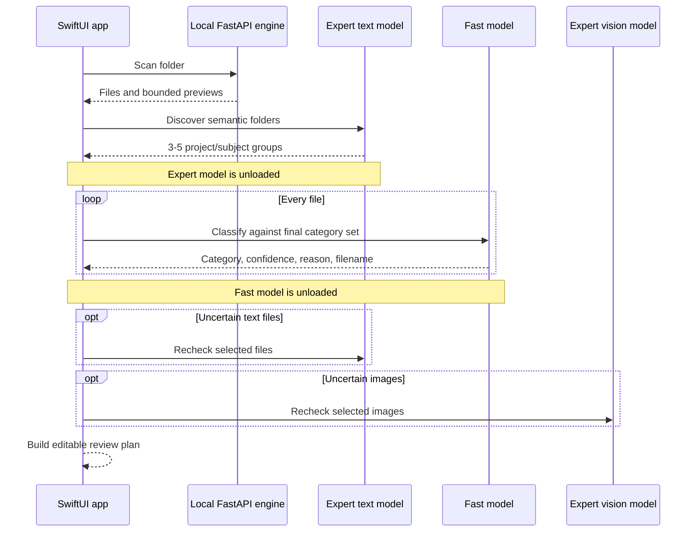
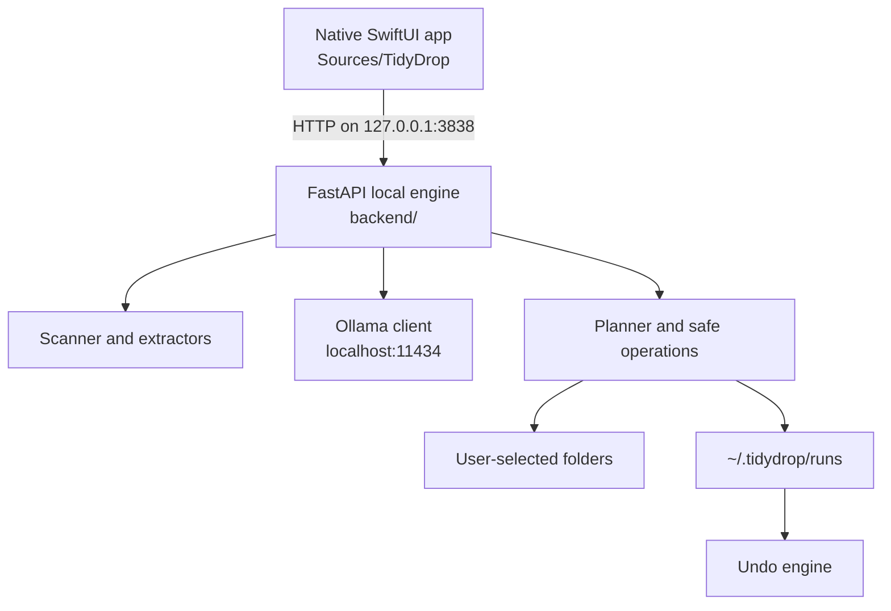

# TidyDrop

**A native macOS utility that uses local Ollama models to understand, rename, and safely organize files.**

[](https://github.com/77Aymeric/tidydrop/actions/workflows/ci.yml)
[](https://www.apple.com/macos/)
[](https://www.swift.org/)
[](https://www.python.org/)
[](https://ollama.com/)
[](LICENSE)



TidyDrop scans a folder without executing its contents, extracts bounded previews, studies the collection as a whole, and proposes meaningful folders based on projects, clients, subjects, events, and dates. Every proposed copy, move, category, and filename remains visible and editable before anything is applied.

It is not a cloud organizer, an automatic cleaner, or a deletion tool.

## Why TidyDrop

Most file organizers group by extension. TidyDrop is designed to group by meaning.

Files such as `brief.pdf`, `logo.png`, `meeting-notes.md`, and `invoice.xlsx` can belong to the same client project even though their formats differ. TidyDrop first studies the entire folder, proposes semantic groups, then classifies each file against those groups. Uncertain decisions are rechecked by a stronger model and still fall back to `To Review` when confidence is insufficient.

## Safety Guarantees

| Guarantee | Behavior |
| --- | --- |
| Local only | File previews are sent only to Ollama on `localhost` |
| Copy by default | Originals remain untouched unless Move is explicitly selected |
| Never deletes | TidyDrop has no delete operation |
| Never overwrites | Existing targets receive a conflict-safe alternate name |
| Preview first | Apply is impossible until an explicit operation plan exists |
| Undo enabled | Copy and move runs both have reversible workflows |
| Bounded extraction | Large files and complex formats are sampled, not fully ingested |
| No execution | Discovered scripts, binaries, and documents are never run |

Invalid model output, invented categories, low confidence, and request failures are treated as review cases rather than trusted decisions.

## Product Tour

### A focused default

The initial screen exposes only the decisions that materially change the outcome: copy or move, output folder, semantic folder discovery, and reviewed filename application.

### Advanced controls remain available



`More Settings` contains scan boundaries, model routing, expert review thresholds, renaming suggestions, and request timeouts. No setting was removed to simplify the default experience.

### Categories and templates



Starter templates provide an immediate category set, while every folder name, description, and rule remains editable. Smart folders can later replace broad starter categories with groups inferred from the collection.

### Preview, history, and undo



The lower workspace keeps file preview and previous runs close to the review plan. Completed runs expose Undo directly, without hiding the operation history.

## End-to-End Workflow

```mermaid
flowchart LR
    A["Drop or choose a folder"] --> B["Read-only scan"]
    B --> C["Bounded content extraction"]
    C --> D{"Smart folders enabled?"}
    D -- Yes --> E["Expert model studies the collection"]
    E --> F["Create semantic categories"]
    D -- No --> G["Use user categories"]
    F --> H["Fast model classifies every file"]
    G --> H
    H --> I{"Uncertain or weak result?"}
    I -- Yes --> J["Expert text or vision review"]
    I -- No --> K["Build operation plan"]
    J --> K
    K --> L["Review paths, names, reasons, confidence"]
    L --> M["User edits or disables operations"]
    M --> N["Explicit Apply"]
    N --> O["Run history"]
    O --> P["Undo preview and apply"]
```



The sequence is intentionally collection-first. New AI-created folders are available before per-file classification, so earlier files are not locked into an obsolete category set.

## Model Routing

TidyDrop supports a small-fast plus larger-expert workflow that is practical on a 16 GB Mac:

| Role | Recommended model | Used for |
| --- | --- | --- |
| Fast pass | `qwen3.5:2b` | Initial classification of every file |
| Expert text | `qwen3.5:9b` | Folder discovery and uncertain text/code/document review |
| Expert vision | `gemma4:e4b-it-qat` | Uncertain image review |

Models are used sequentially and explicitly unloaded between phases to reduce peak memory pressure. TidyDrop never downloads a model automatically.



Approximate local model storage for this combination is 15.4 GB before Ollama overhead:

```bash
ollama pull qwen3.5:2b
ollama pull qwen3.5:9b
ollama pull gemma4:e4b-it-qat
```

You can select any installed Ollama models in `More Settings`. See [Model Strategy](docs/MODELS.md) for routing details and lower-storage alternatives.

## File Understanding

| Type | Read-only understanding |
| --- | --- |
| Images | Metadata; image bytes are loaded lazily for a vision request, up to the configured limit |
| PDF | Text sampled from the first pages with PyMuPDF |
| DOCX | First meaningful paragraphs with `python-docx` |
| TXT, Markdown, CSV, JSON, XML, YAML | Bounded decoded text preview |
| Source code | Extension detection and bounded source preview |
| XLSX | Sheet names and sampled cells with `openpyxl` |
| ZIP | Internal filename listing only; never extracted |
| Other archives | Metadata only |
| Audio and video | Metadata only |
| Unknown or binary | Name, extension, size, path, dates, and MIME guess |

Files above the configured analysis size are still listed, but deep extraction is skipped.

## Review Before Apply

The review plan exposes every operation:

- original filename and full source path;
- target folder and full target path;
- editable proposed filename;
- semantic reason and calibrated confidence;
- copy or move action;
- conflict status;
- enabled/disabled toggle;
- manual category override;
- file preview, Open, and Show in Finder actions.

Changing a category or filename recomputes the target before Apply. The user remains the final decision-maker.

## Apply, History, and Undo

Copy mode is the default. Completed runs are stored in `~/.tidydrop/runs/<run_id>.json`.

- Copy undo moves generated copies into `~/.tidydrop/undone/<run_id>/`; it does not delete them.
- Move undo restores originals in reverse order.
- If a destination already exists, TidyDrop chooses an alternate path such as `Document (1).pdf`.
- Missing files, disabled actions, conflicts, and errors remain visible in the run record.

## Requirements

- macOS 26+
- Xcode 26+ with Swift 6.2
- Python 3.11+
- Ollama for AI classification

Scanning and preview generation work without Ollama. Classification requires the local Ollama service:

```bash
ollama serve
```

## Quick Start

```bash
git clone https://github.com/77Aymeric/tidydrop.git
cd tidydrop

python3 -m venv .venv
source .venv/bin/activate
python -m pip install --upgrade pip
python -m pip install -e ".[dev]"

./script/build_and_run.sh
```

The script builds `dist/TidyDrop.app`, opens the native app, and lets the app manage its local backend on `127.0.0.1:3838`. There is no browser UI.

## Sorting Templates

The app includes five starting points, each with a `To Review` fallback:

- Downloads Cleanup
- Student Mode
- Developer Mode
- Photo Cleanup
- Admin Papers

Categories remain editable. Smart folders can also replace generic starter groups with collection-specific project, client, topic, event, or period folders.

French category examples:

- `Projet Atlas`
- `Factures 2026`
- `Cours de droit`
- `Voyage Japon`
- `A verifier`

## Architecture



SwiftUI owns the window, drag and drop, settings, progress, review, preview, history, and undo experience. Python owns format extraction, Ollama requests, output validation, path planning, file operations, and run persistence.

See [Architecture](docs/ARCHITECTURE.md) and [Workflow](docs/WORKFLOW.md) for the full contracts.

## Local API

The backend binds only to `127.0.0.1:3838`.

| Method | Endpoint | Purpose |
| --- | --- | --- |
| `GET` | `/api/health` | Backend and Ollama status |
| `GET` | `/api/ollama/models` | Installed local models |
| `POST` | `/api/scan` | Read-only folder scan |
| `POST` | `/api/categories/discover` | Collection-level semantic folder discovery |
| `POST` | `/api/classify` | Per-file classification |
| `POST` | `/api/plan` | Create an explicit operation plan |
| `POST` | `/api/apply` | Apply enabled plan operations |
| `GET` | `/api/history` | List runs |
| `GET` | `/api/history/{run_id}` | Read a run |
| `POST` | `/api/undo/preview` | Preview reversal |
| `POST` | `/api/undo/apply` | Apply reversal |
| `POST` | `/api/open-folder` | Open a local folder in Finder |

See [Local API](docs/API.md) for request behavior.

## Prompts and AI Contract

TidyDrop does not hide its model instructions. The exact current prompts, JSON schemas, generation options, confidence rules, and response recovery behavior are documented in [System Prompts](docs/PROMPTS.md). The executable source of truth remains [`backend/ollama_client.py`](backend/ollama_client.py).

Important runtime constraints:

- structured JSON schema output;
- `temperature: 0`;
- reasoning disabled with `think: false`;
- 4,096-token context for classification;
- 8,192-token context for collection discovery;
- bounded output lengths;
- category validation and confidence fallback after generation.

## Development

```bash
swift build
python -m pytest
python -m ruff check backend tests
./script/build_and_run.sh --verify
```

CI runs backend lint/tests on Linux and builds the native SwiftUI app on macOS 26.

```text
Sources/TidyDrop/       Native macOS product
backend/                Local FastAPI engine
backend/extractors/     Bounded format understanding
tests/                  Backend safety and workflow tests
script/                 Build and run entrypoint
docs/                   Architecture and product documentation
.github/                CI and contribution templates
```

## Documentation

- [Workflow](docs/WORKFLOW.md)
- [Architecture](docs/ARCHITECTURE.md)
- [Model Strategy](docs/MODELS.md)
- [System Prompts](docs/PROMPTS.md)
- [Safety Model](docs/SAFETY.md)
- [Local API](docs/API.md)
- [Development Guide](docs/DEVELOPMENT.md)
- [Roadmap](docs/ROADMAP.md)
- [Contributing](CONTRIBUTING.md)
- [Security Policy](SECURITY.md)
- [Changelog](CHANGELOG.md)

## Project Status

TidyDrop is an alpha-stage open-source project. The safety model, scan/classify/plan/apply workflow, history, and undo are implemented. Packaging, notarization, richer media understanding, and broader end-to-end UI testing are still evolving.

## License

TidyDrop is available under the [MIT License](LICENSE).
