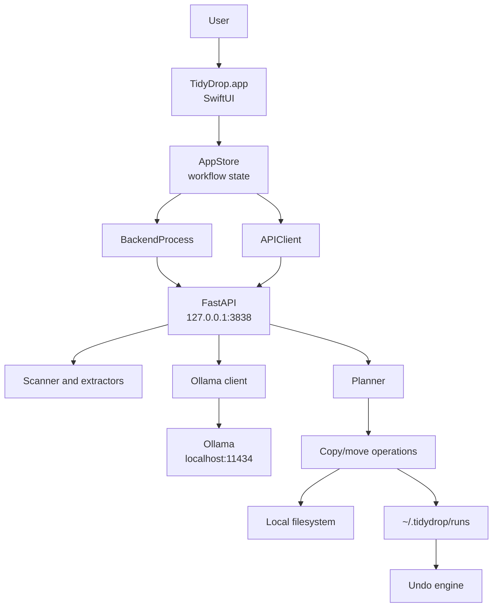

# Architecture

TidyDrop is a native macOS app with a local Python engine and local Ollama inference. There is no web UI or cloud service.

## System Diagram



## Native macOS Layer

Source: `Sources/TidyDrop`

| Area | Responsibility |
| --- | --- |
| `App/` | Scene setup and native application entrypoint |
| `Views/` | Sidebar, settings, templates, review, preview, results, history |
| `Stores/AppStore.swift` | End-to-end workflow, progress, cancellation, model routing |
| `Services/APIClient.swift` | Typed local HTTP calls and Ollama unload requests |
| `Services/BackendProcess.swift` | Python discovery, process lifecycle, logs |
| `Models/` | Swift representations of settings, files, plans, runs, and templates |
| `Support/` | Formatting and Liquid Glass compatibility |

The app uses native `NavigationSplitView`, toolbars, file importers, drag and drop, sheets, controls, and system materials.

## Local Engine

Source: `backend`

| Module | Responsibility |
| --- | --- |
| `main.py` | FastAPI route boundary |
| `scanner.py` | Traversal, exclusions, kind detection, symlink checks |
| `extractors/` | Bounded read-only file understanding |
| `ollama_client.py` | Health, model list, prompts, schemas, generation |
| `classifier.py` | Category validation, confidence fallback, filename normalization |
| `planner.py` | Explicit operation plan and conflict-safe target paths |
| `operations.py` | Copy/move apply and status recording |
| `history.py` | JSON run persistence |
| `undo.py` | Reverse-order undo preview and application |

## Trust Boundaries

```mermaid
flowchart LR
    A["Untrusted user files"] -->|"read-only bounded extractors"| B["Typed FileItem"]
    B -->|"local prompt"| C["Untrusted model output"]
    C -->|"schema + semantic validation"| D["ClassificationResult"]
    D -->|"explicit planner"| E["OperationPlan"]
    E -->|"human review + Apply"| F["Filesystem operation"]
```



User files and model output are both treated as untrusted. Only validated typed data can reach the planner, and only an explicit plan can reach apply.

## Data Storage

TidyDrop writes application state under the user's home directory:

```text
~/.tidydrop/
├── config.json
├── logs/
│   └── backend.log
├── runs/
│   └── <run_id>.json
└── undone/
    └── <run_id>/
```

The selected output folder contains the organized copies or moved originals. By default it is `TidyDrop Sorted` inside the selected source folder.

## Process Lifecycle

The packaged SwiftUI app starts the local Python backend when needed, polls `/api/health`, and reports startup failures with the backend log path. The backend binds to loopback only.

Ollama is a separate local service. TidyDrop can scan and preview while Ollama is unavailable, but cannot classify.

## Why Swift and Python

SwiftUI provides a native macOS interaction model, window behavior, system materials, Finder integration, and accessible controls. Python provides mature document extraction libraries and conservative filesystem primitives. Their boundary is a small typed loopback API.
